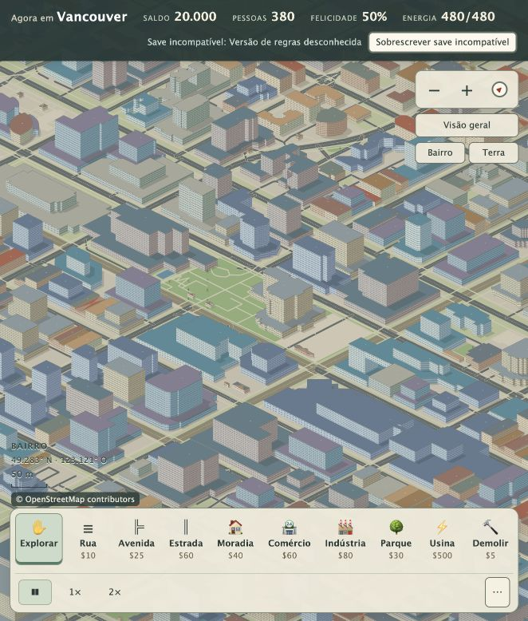
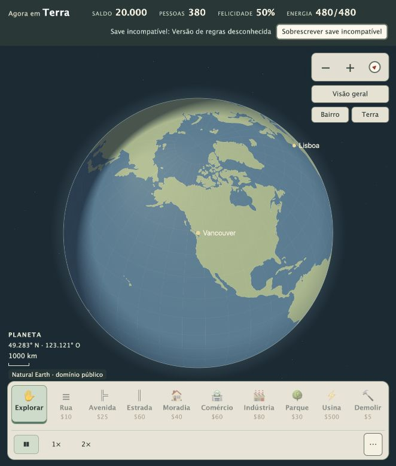

# Referência de qualidade visual — 2 de outubro de 2026

Estado aprovado pelo usuário: “ficou ótimo”. Este registro fixa o nível visual aprovado para comparação em futuras mudanças.

Implementação de referência: `c809574` (cidade real e zoom até o planeta). Capturas feitas no GitHub Pages após a publicação, em viewport de 662 × 778 pixels. O commit que adiciona este diretório é o marco de qualidade na branch `codex/open-sim-design`.

## Capturas aprovadas

## Critérios para evitar regressões

- Prédios conservam os contornos reais; um edifício não vira várias casinhas por ocupar várias células da simulação.
- Paredes, telhados, sombras, cores e alturas variadas tornam a cidade legível em escala de bairro. Alturas e fachadas sem dados da fonte são ilustrativas.
- Ruas conservam curvas e continuidade; parques, água e costa permanecem alinhados à geografia real.
- Edifícios que cruzam trechos do mapa não apresentam volumes duplicados ou alturas incompatíveis nas emendas.
- O zoom preserva o ponto geográfico observado e permite percorrer bairro, cidade, região e planeta, nos dois sentidos.
- A visão distante mostra geografia legível, sem o mosaico de células da implementação anterior.
- O globo apresenta continentes reais, pode ser arrastado e permite voltar ao bairro no foco escolhido.
- Zoom, ferramentas, velocidade, painéis e atribuição permanecem acessíveis em desktop e celular; ferramentas excedentes podem ser alcançadas por rolagem horizontal.
- Construção e demolição afetam as células escolhidas. Crescimento da simulação não substitui os contornos importados.
- Mapas parciais não sobrepõem trechos de níveis diferentes; telas de alta resolução mantêm cobertura do mapa com demanda de rede limitada.

## Como conferir uma mudança

Compare visualmente Vancouver (49.2827, -123.1207), São Paulo (-23.5505, -46.6333) e Lisboa (38.7223, -9.1393), em bairro, visão geral e planeta. Experimente rotação, zoom nos dois sentidos, arrasto, construção e demolição. Confira uma tela de 390 × 844 e a cobertura em alta resolução. Execute `npm run check` e `npm run build`; testes verdes complementam a comparação visual, mas não comprovam sozinhos a qualidade estética.

O aviso de save incompatível nas capturas é uma limitação conhecida da base de regras do `origin`, anterior a esta referência visual. O save foi preservado. Esse aviso não é um requisito visual a reproduzir.

As capturas são uma referência de aparência e comportamento, não um teste de igualdade exata de pixels: carregamento dos dados, animação, câmera e tamanho da tela podem variar.
