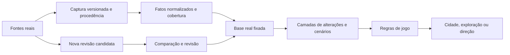
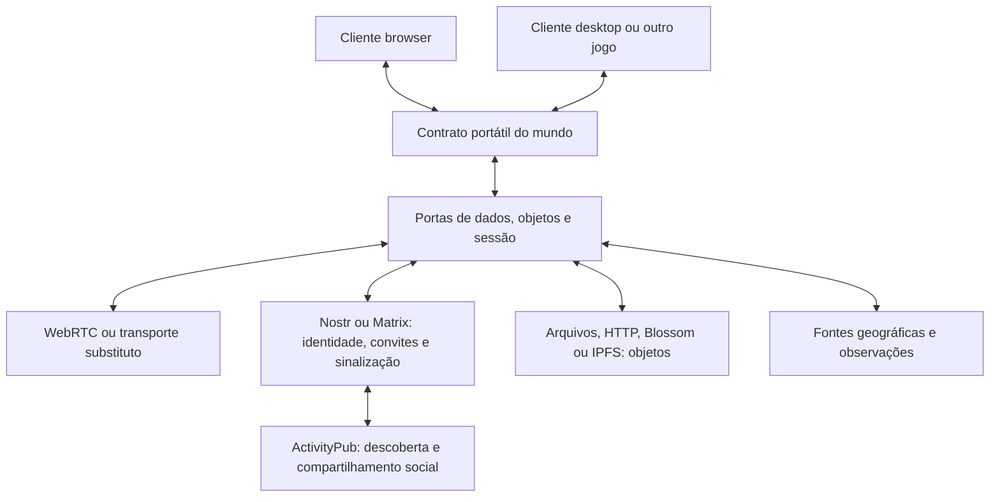

# Open Sim — mundos reais, versões e colaboração federada

**Status:** especificação proposta; nenhuma funcionalidade descrita aqui deve ser tomada como já implementada. Data: 2026-09-29. Base inspecionada: commit `8c7f793`.

**Objetivo:** permitir que pessoas joguem, transformem, comparem e compartilhem versões de lugares reais, em navegador ou aplicativo, sem depender de um servidor dedicado de simulação nem de uma plataforma social única.

Esta especificação amplia a [carta de arquitetura](../../architecture.md), o [contrato portátil](../../world-protocol.md), a [pesquisa de precedentes](../../research/interoperability-precedents.md) e o [desenho original](2026-09-29-open-sim-design.md). Seu [plano de implementação](../plans/2026-09-29-federated-world.md) separa entregas pequenas. A experiência continua sendo um jogo fofo e simples: complexidade de dados e protocolos fica nos adaptadores e nas ferramentas de colaboração.

## 1. O produto que esta arquitetura permite

Uma pessoa abre sua cidade real, reforma uma praça e chama amigos. Outro grupo cria uma versão com menos carros; um terceiro simula uma enchente fictícia sobre o mesmo terreno. As três versões compartilham dados de origem, mas têm histórias e regras próprias. Uma ciclovia pode ser proposta de uma versão para outra. Meses depois, uma atualização da cartografia chega como uma mudança comparável, sem destruir as reformas dos jogadores.

O multiplayer inclui construção simultânea, contribuição assíncrona, publicação de cenários, visitas e intercâmbio entre tipos de jogo. Conectar computadores é só uma parte disso.

**Premissas iniciais:** cooperação entre 2–8 pessoas conhecidas; perfil cidade existente; geografia contínua carregada sob demanda; uma sessão ativa por ramificação; navegador primeiro, mesmos contratos em desktop. Esses números definem o primeiro alvo de teste, não uma limitação do formato.

Não fazem parte da primeira entrega: simular o planeta inteiro, MMO competitivo, moeda transferível entre mundos, consenso global, edição automática do OSM, importação indiscriminada de bases ou execução de código recebido de outros jogadores.

## 2. Princípios e requisitos transversais

| ID | Requisito |
| --- | --- |
| R1 | Uma partida local continua abrindo e funcionando sem conta, relay ou rede. |
| R2 | Dado reportado por uma fonte, transformação, inferência e ficção do jogador têm procedência distinguível. |
| R3 | Uma partida fixa as revisões dos dados e das regras que afetam sua simulação; atualizações entram por operação explícita. |
| R4 | Mundos têm histórico, ramificações, diferenças e integração seletiva; nenhuma integração global é obrigatória. |
| R5 | Integrações preservam invariantes do destino: dinheiro, identidades, população, permissões e dependências espaciais. |
| R6 | O contrato não exige navegador, engine, banco, fornecedor de mapas, protocolo social ou armazenamento específico. |
| R7 | O mesmo estado inicial, entradas externas registradas, regras e operações ordenadas produzem o mesmo estado durável. |
| R8 | Nenhum servidor dedicado executando a simulação é obrigatório; serviços de conexão, identidade e armazenamento podem existir. |
| R9 | Identidade, permissão, ordenação, transporte e armazenamento são funções separadas. |
| R10 | Componentes desconhecidos são preservados; regras críticas desconhecidas impedem escrita que dependa delas. |
| R11 | Histórico privado, convites, chaves e localização da câmera não são publicados por padrão. |
| R12 | Atribuição, condições de redistribuição, cobertura e limitações dos dados acompanham os objetos exportados. |
| R13 | Memória, transferência e processamento dependem da área de interesse e do mundo administrado, não da área do planeta. |

Os schemas propostos usam `worldProtocol: 2` e `wireVersion: 1`, separados do `protocol: 1` do manifesto atual. São versões de projeto, ainda não padrões públicos. Um importador v2 lê o formato existente e cria uma origem de histórico; o cliente antigo permanece apto a abrir seus saves antigos. Não anunciar compatibilidade de escrita v2 para clientes que só entendem v1.

## 3. Como a realidade vira jogo

### 3.1 Fluxo de transformação

A fonte descreve algo sobre o mundo; o normalizador traduz; o perfil escolhe o que significa jogar com isso. Um edifício mapeado pode gerar uma construção jogável. Sua população, capacidade elétrica e custo não se tornam estatísticas reais por terem sido calculados a partir de uma geometria real.

Cada etapa produz objetos imutáveis endereçados por conteúdo. Guardar a entrada utilizada, a versão do normalizador e seus parâmetros permite explicar e reproduzir a conversão. Se a redistribuição da entrada não for permitida, guardar a referência e os produtos permitidos, declarando o que não será reproduzível sem acesso à fonte.

### 3.2 Famílias de dados e usos possíveis

| Dados | O que pode virar jogo | Cuidados de interpretação | Momento |
| --- | --- | --- | --- |
| OSM: ruas, água, edifícios, vegetação | Base da cidade; vias, ocupação e áreas vazias | Ausência de feição não prova terreno vazio; tags e detalhes dependem do fornecedor | Já existe; acrescentar procedência e revisão |
| Elevação, relevo, bacias | Encostas, pontes, escoamento, custo de construção | Resolução, unidade vertical, datum e áreas sem dados; terreno atual é plano | Primeiro novo tipo de base, depois do fluxo de revisão |
| Uso do solo e cobertura vegetal | Biomas, parques, restrições opcionais e recursos | Observação de satélite não equivale a zoneamento legal | Extensão de cenário |
| Transporte público e infraestrutura aberta | Linhas, estações, serviços e redes simplificadas | Rede física, horário publicado e disponibilidade observada são coisas diferentes | Extensão por perfil |
| Clima histórico, previsão e observações | Estações, chuva, vento e eventos de cenário | Previsão não é medição; captura precisa de instante e validade | Entradas externas gravadas |
| Estatísticas públicas agregadas | Densidade inicial e parâmetros de bairros | Estimativa regional não identifica moradores de uma casa | Calibração opcional |
| Dados históricos | Uma cidade em épocas diferentes | Cobertura e precisão desiguais; não inventar uma data exata para capturas sem data | Cenários históricos |
| Dados comunitários | Projetos urbanos, roteiros, anotações e cenários | Proposta de jogador não modifica fatos da fonte | Colaboração assíncrona |

Formatos de entrada são adaptadores: GeoJSON para feições, catálogos STAC para localizar ativos espaciais e temporais, GTFS para transporte, arquivos regionais e APIs geográficas para outras fontes. Não são protocolos de simulação. STAC estrutura metadados de ativos; GTFS separa dados de horários e dados em tempo real. [STAC](https://github.com/radiantearth/stac-spec), [GTFS](https://gtfs.org/documentation/overview/), [GeoJSON / RFC 7946](https://www.rfc-editor.org/rfc/rfc7946).

### 3.3 Registro mínimo de procedência

Um `DatasetRevision` registra: identidade da fonte e do conjunto; revisão do fornecedor quando disponível; `observedAt`/intervalo representado, `publishedAt` e `retrievedAt` separadamente; cobertura espacial; resolução; sistema de coordenadas e unidades; licença e atribuição; hashes dos objetos usados; versão da transformação; relação com revisões anteriores. Campos temporais desconhecidos são explicitamente ausentes, nunca preenchidos com a data do download como se fosse a data do fato.

Um `SourceClaim` liga uma feição ou atributo a essa revisão, ao identificador original quando existir, ao método (`reported`, `derived`, `simulated`, `player`) e à qualidade declarada. Preservar valores contraditórios de fontes diferentes; uma política versionada escolhe qual entra em cada camada. Não calcular uma falsa probabilidade de certeza só para preencher um campo.

Essa separação entre entidade, transformação e agente segue a ideia de procedência do W3C PROV, sem exigir RDF ou toda a ontologia no núcleo. [W3C PROV](https://www.w3.org/TR/prov-overview/).

No adaptador Shortbread atual, nem toda geometria tem um identificador estável da feição original. Nesses casos o registro é por captura/trecho e a ligação com objetos OSM individuais permanece desconhecida. IDs gerados por coordenada não devem ser apresentados como IDs OSM.

### 3.4 Identidade espacial e passagem entre escalas

Fatos portáveis usam longitude e latitude nomeadas, unidade explícita e geometria quando necessária; altitude exige referência vertical. A grade do perfil cidade continua sendo um endereço interno válido para seus comandos. Web Mercator não deve virar a definição do planeta: o cliente atual declara sua cobertura e não simula polos por aproximação silenciosa.

Uma `WorldEntity` tem ID estável dentro de sua linhagem e referências opcionais às feições de origem. A identidade do prédio do jogo não muda porque a fonte redesenhou seu contorno. Divisões, fusões e demolições na fonte produzem propostas explícitas de correspondência; associação ambígua vira conflito revisável. Entidades e vias que atravessam trechos têm uma identidade, múltiplas referências de índice espacial e uma única contabilização.

Um perfil pode mostrar 64 moradores como agregado; outro pode materializar quatro personagens. Deve continuar valendo `64 = 60 + 4`. Os personagens são simulados; não correspondem a pessoas reais por inferência. Materialização é uma operação com reserva e devolução, não uma duplicação de entidades ao aproximar a câmera.

### 3.5 Tempo e atualizações externas

Separar quatro tempos: período representado pelos dados; instante de captura/publicação; tick lógico da simulação; momento de criação/recebimento de uma mensagem. Relógio de rede não decide resultado econômico nem resolve conflito.

Três modos de fonte: **fixada**, padrão reproduzível; **acompanhada**, que anuncia revisões para comparar; **ao vivo gravada**, que converte uma observação aceita em `ExternalInput` com payload, origem e tick de efeito. Cada participante reproduz esse evento, sem consultar sua própria API de clima durante o tick.

Na falta de dados, o perfil declara uma política: pausar a dependência, manter o último valor com indicação de desatualizado ou aplicar um valor de cenário explicitamente simulado. Previsões corrigidas não reescrevem partidas passadas. Mudar regras, normalizador ou política de ausência também exige nova revisão.

OSM possui diffs de replicação, mas consumi-los é uma capacidade futura de um adaptador de extratos; não é uma propriedade dos tiles atuais. Atualização regional deve usar um serviço apropriado, sem cada browser replicar o planeta. [OSM replication diffs](https://wiki.openstreetmap.org/wiki/Planet.osm/diffs).

### 3.6 Licenças, distribuição e retorno à realidade

Pacotes mantêm um inventário de fontes e termos por camada. Uma fonte pública não implica redistribuição irrestrita. A base OSM usa ODbL e exige atribuição e cumprimento das condições aplicáveis à distribuição de dados derivados; separar arquivos não resolve automaticamente a classificação de uma base derivada. O exportador precisa respeitar a política registrada para cada produto. [OSM copyright](https://www.openstreetmap.org/copyright).

A política de tiles vetoriais da OSM Foundation proíbe downloads em massa para montar arquivos offline; pacotes regionais devem vir de fontes que permitam esse uso. Preservar a base já adotada para reproduzir uma partida não autoriza varrer tiles para construir um espelho. [Política de tiles vetoriais](https://operations.osmfoundation.org/policies/vector/).

Alterações do jogo nunca são enviadas automaticamente ao OSM ou a cadastros públicos. Uma futura contribuição cartográfica exige observação real independente, revisão humana e o processo da comunidade da fonte. Compartilhar um projeto urbano fictício deve identificá-lo como cenário. Fontes pessoais ou rastreamento individual não são necessários para o produto.

## 4. Multidimensão: várias versões do mesmo lugar

“Dimensão” não será um único número ou um mundo paralelo copiado por inteiro. Há eixos independentes:

| Eixo | Pergunta respondida | Representação |
| --- | --- | --- |
| Lugar | Qual região e quais objetos? | Geometria, índice espacial, entidades |
| Revisão da realidade | Quais dados externos sustentam esta versão? | Conjunto fixado de `DatasetRevision` |
| História de alterações | Quais decisões dos jogadores foram aceitas? | DAG de commits e referências de ramificação |
| Cenário | Quais hipóteses se aplicam? | Camadas e parâmetros versionados |
| Perfil e regras | Como se joga e quais invariantes valem? | Perfis, versões e capacidades requeridas |
| Tempo da simulação | Em qual evolução estamos? | Tick e histórico de entradas |
| Resolução | Agregado ou detalhe materializado? | Relações conservativas, não cópias |
| Participação | Quem vê, propõe ou altera? | Política de compartilhamento e concessões |

Uma **composição** fixa referências exatas a uma base e a camadas compatíveis. Exemplo: Lisboa/captura A + reforma dos amigos/commit B + cenário chuva/commit C, executados por CityRules v1. Mover a câmera ou mudar a arte não cria uma dimensão persistente. Outra versão das regras pode exigir uma ramificação incompatível, não um simples filtro visual.

Camadas declaram dependências, campos que escrevem, áreas afetadas e capacidades exigidas. Camadas só de visualização podem ser ligadas livremente. Camadas que afetam a simulação precisam ser fixadas e validadas juntas; duas camadas que escrevem o mesmo campo geram conflito, salvo uma regra explícita e versionada de composição. A ordem visual dos botões nunca decide silenciosamente qual cidade existe.

Criar ramificação reutiliza objetos imutáveis e guarda apenas novos objetos e referências. Não materializar o produto cartesiano de todos os eixos. Um fork em outro grupo ganha `worldId` próprio e conserva origem exata; uma branch no mesmo mundo mantém `worldId`, ganha `branchId` estável e pode ter nome renomeável.

O fork não herda automaticamente participantes, concessões ou sessão ativa. Seu criador estabelece a política do novo mundo. Recontextualizar `GameState.worldId` é uma transição explícita de origem: objetos de base permanecem compartilháveis, mas não se finge que o snapshot inteiro continua tendo o mesmo hash. Sequências restauradas são interpretadas no contexto da nova branch, sem aceitar envelopes assinados para a origem.

## 5. Histórico inspirado em Git, próprio para mundos

### 5.1 Objetos e referências

O precedente útil do Git é separar conteúdo imutável, árvores, commits e referências mutáveis. Não é necessário executar Git no jogo nem representar cada célula como arquivo. O protocolo usa seu próprio codec e SHA-256, sem prometer compatibilidade com objetos Git. [Git objects](https://git-scm.com/book/en/v2/Git-Internals-Git-Objects).

| Objeto | Conteúdo e responsabilidade |
| --- | --- |
| `WorldDefinition` | Identidade, origem, perfis, políticas de dados/tempo e extensões |
| `DatasetRevision` | Evidência externa fixada e condições de uso |
| `WorldTree` | Referências a base, trechos, entidades, componentes, parâmetros e estado econômico |
| `ChangeSet` | Intenções, precondições, dependências, área afetada e resumo para revisão |
| `WorldCommit` | Pais, árvore resultante, operações aceitas, regras, referências de dados e autor; prova de aceitação separada |
| `BranchRef` | `worldId`, `branchId`, commit atual, geração, referência anterior e prova de atualização autorizada |
| `MergeProposal` | Origem/destino exatos, ancestral, operações selecionadas, conflitos e resultado da prévia |
| `Checkpoint` | Estado restaurável e histórico necessário até um commit; não é apenas uma imagem do mapa |

O primeiro pai de um commit define a linha de aplicação. Outros pais registram integração. O resultado de merge é uma transição validada sobre o primeiro pai, não uma mistura implícita dos estados dos pais. Referências avançam por comparação com o head esperado; uma publicação atrasada não desfaz progresso.

No protótipo, uma transação durável aceita pode produzir um commit. Posteriormente, agrupar operações em um commit é permitido se o grupo só for confirmado depois de persistido atomicamente. A interface reúne ticks e pequenas ações em resumos legíveis. Não recalcular nem transmitir o planeta para cada mudança: árvores particionadas reutilizam objetos sem alterações; começar com snapshots dos mundos pequenos e medir antes de otimizar.

### 5.2 Operações que a pessoa reconhece

| Operação | Comportamento |
| --- | --- |
| Criar versão | Criar branch/fork a partir de um commit, sem alterar a origem |
| Comparar | Mostrar adições, remoções, fontes, hipóteses e efeitos econômicos na área escolhida |
| Propor mudanças | Enviar um pacote de alterações e seu contexto, inclusive offline |
| Integrar seleção | Aplicar mudanças escolhidas, revalidadas e precificadas no destino |
| Atualizar base real | Comparar revisão antiga/nova e reconciliar a camada do jogador |
| Desfazer | Produzir operação compensatória validada, mantendo o histórico compartilhado |
| Voltar no tempo | Abrir um commit para leitura ou criar uma nova branch a partir dele |
| Sincronizar | Obter objetos ausentes e novas propostas; isso não implica integrá-las |

Reescrever histórico publicado e `force push` não são funções iniciais. Uma ramificação privada descartável pode ser abandonada. Desfazer uma usina que já alimentou crescimento não desfaz magicamente todos os efeitos passados: a prévia explica a compensação possível.

### 5.3 Merge espacial e semântico

Comparar ancestral comum, destino e origem por entidade, campo e dependências. A identidade de trechos organiza acesso; não é suficiente para detectar conflito. Duas ruas em trechos diferentes podem disputar a mesma ponte, energia ou orçamento.

| Caso | Tratamento |
| --- | --- |
| Um lado mudou, o outro não | Candidato a integração após validar dependências e regras |
| Ambos chegaram ao mesmo valor | Deduplicar o fato; não cobrar duas vezes pelo mesmo efeito |
| Alterações independentes | Compor somente se precondições e invariantes continuarem válidas |
| Ambos mudaram o mesmo campo; remover versus editar | Conflito explícito com prévia e escolha |
| Construção concorrente na mesma área | Testar sobreposição geométrica e ocupação, mesmo com IDs diferentes |
| Dados novos cruzam obra do jogador | Manter a obra até revisão; oferecer preservar, adaptar ou substituir |
| Dinheiro, crescimento ou população divergentes | Não somar snapshots; importar intenções permitidas e recalcular no destino |
| Regras, tempo ou base incompatíveis | Exigir migração declarada ou manter versões separadas |
| Componente desconhecido | Preservar; só adotar mudança unilateral opaca se não crítica; conflito se ambos alteraram |
| Identidade de fonte dividida/fundida | Revisar correspondência antes de reaplicar alterações |

Um `ChangeSet` preserva intenção e precondição por campo. O modelo atual guarda substituições de `Cell`; saves antigos entram como alterações opacas de célula completa. Não inventar a intenção histórica que o save não registrou. Novos comandos passam a registrar o que alteraram, permitindo uma revisão de uso do solo sem apagar uma rua por acidente.

Integração assíncrona tem dois modos declarados: **projeto**, importar ações de construção com orçamento e regras do destino; **continuação**, avançar por um histórico já aceito compatível. Nunca trazer o caixa de um fork como receita do destino. Um projeto com custo acima do limite aprovado para em prévia, sem aplicação parcial acidental.

### 5.4 Atualizar a realidade sem apagar o jogo

Exemplo: base A tem um estacionamento; Ana transforma-o em parque; base B passa a mostrar um edifício naquele local. O candidato de atualização mostra três estados e a fonte da mudança. Preservar o parque mantém a alteração virtual e registra que ela diverge de B. Adotar o edifício exige resolver a alteração do parque. A escolha produz novo commit com B como base referenciada, sem apagar A do histórico ainda retido.

Se a base mudar numa região não tocada pelo jogador, ainda validar efeitos econômicos. Importar edifícios não deve criar dinheiro retroativo ou alterar silenciosamente o saldo inicial. A política do perfil decide como integrar capacidade/população; a operação registra a decisão.

### 5.5 Armazenamento, histórico e disponibilidade

Pacotes exportáveis contêm manifesto, objetos alcançáveis, termos de uso, provas e hashes. Um pacote completo abre sem consultar a origem; um pacote parcial declara objetos faltantes e o que permite visualizar ou simular. Não confundir cache de exploração descartável com objetos necessários para restaurar uma branch.

Retenção é uma política explícita: manter heads, bases, propostas pendentes e checkpoints fixados; coletar apenas objetos inalcançáveis pelas referências retidas. Arquivar segmentos antigos pode limitar replay anterior, e a interface deve informar isso. Não prometer histórico eterno num navegador sujeito a quota/remoção de armazenamento. Conteúdo privado apagado localmente pode continuar nas cópias de outros participantes.

## 6. Colaboração: ao vivo, assíncrona e entre mundos

### 6.1 Jornadas

1. **Jogar sozinho:** escolher um lugar; adotar base; construir; salvar; exportar versão completa.
2. **Jogar com amigos:** abrir uma versão; convidar; sincronizar base e histórico; construir juntos; mostrar alterações confirmadas e pendentes.
3. **Contribuir depois:** receber versão; criar branch; construir offline; enviar proposta; o destinatário compara e integra.
4. **Comparar futuros:** ramificar uma cidade em cenários; executar o mesmo intervalo e entradas externas; comparar indicadores com regras e premissas visíveis. Isso é simulação, não previsão validada da cidade real.
5. **Receber dados novos:** localizar revisão; baixar somente a cobertura relevante de fonte adequada; revisar diferenças; atualizar uma branch escolhida.
6. **Visitar outro mundo:** abrir como espectador, respeitando dados privados e capacidades; solicitar colaboração ou criar fork permitido.
7. **Usar outro jogo:** um explorador utiliza as mesmas entidades e ruas, preserva componentes da cidade e materializa somente o que seu contrato permite.

### 6.2 Portais e federação de mundos

Uma ligação entre mundos referencia mundo/branch/commit ou uma referência mutável identificada, lugar de chegada e capacidades desejadas. Viajar não copia permissões. Perfil visual, apelido e itens cosméticos podem acompanhar o jogador quando suportados; dinheiro, propriedade e habitantes não são transferíveis por padrão.

Uma futura transferência de recurso escasso precisaria de reserva, aceite e consumo verificáveis nos dois lados, com recuperação de falha. Isso fica fora das primeiras fases; exportar/importar um objeto não deve ser vendido como transferência exclusiva. Mundos autônomos podem simplesmente recusar um perfil, uma origem ou uma proposta.

### 6.3 Experiência simples

Ações principais: **Minha cidade**, **Criar versão**, **Convidar**, **Comparar**, **Propostas**, **Atualizar mapa real** e **Exportar**. Configuração de relays, homeservers, codecs e NAT fica em opções avançadas. A pessoa deve ver o nome da versão e estados claros: “Salvo neste dispositivo”, “Copiado por 1 amigo”, “Mudanças pendentes”, “Partida pausada” e “Fonte desatualizada”.

Não mostrar “salvo na rede” só porque uma mensagem foi enviada. Publicar mundo, compartilhar convite e conectar conta são ações explícitas. Explorar um mapa não revela automaticamente aos amigos a localização da câmera ou a localização física da pessoa.

## 7. Sessão multiplayer sem servidor dedicado

### 7.1 Modelo de execução escolhido

| Modelo | Uso e consequência |
| --- | --- |
| Participante anfitrião + réplicas verificadoras | Escolha inicial: simples, compatível com o núcleo atual; depende de um participante conectado para avançar a sessão |
| Lockstep entre todos | Possível perfil futuro; exige regras equivalentes, coordenação e tratamento de atrasos; não elimina disputa de permissão |
| Múltiplos escritores com CRDT | Útil para anotações e alguns componentes com operações comutativas; não resolve sozinho gasto de dinheiro, ocupação e conservação |
| Serviço comunitário persistente | Adaptador opcional para disponibilidade contínua; nunca requisito para abrir o mundo ou jogar localmente |

Um jogador executa o papel de anfitrião e ordena transações de uma branch. Réplicas verificam as operações e calculam o mesmo resultado. Quando todos saem, a simulação para; o mundo continua existindo nas cópias persistidas. Não há crescimento econômico oculto em um servidor.

“Sem servidor dedicado” não significa ausência de infraestrutura: descoberta, autenticação, armazenamento, STUN e TURN podem ser serviços públicos, comunitários ou contratados. TURN pode ser necessário quando uma conexão direta falha. Suas quotas, custo e disponibilidade aparecem na configuração operacional. [TURN / RFC 8656](https://www.rfc-editor.org/rfc/rfc8656).

### 7.2 Cinco funções independentes

**Identidade:** quem assinou. **Permissão:** o que esse principal pode fazer nesta branch. **Ordenação:** qual transação válida vem primeiro. **Transporte:** como os bytes chegam. **Persistência:** quais bytes continuam disponíveis após desconectar. Trocar uma dessas funções não deve alterar o significado da cidade.

Papéis iniciais: proprietário da branch, anfitrião delegado, colaborador e visitante. Uma concessão declara principal, mundo/branch, namespaces, ações e, quando usados, entidades/regiões e limite de gasto. O anfitrião não pode ampliar sua concessão. Seguir alguém no Nostr ou entrar em uma sala Matrix não concede poder de demolir uma construção.

Identidades do protocolo têm esquema declarado. O adaptador pode provar controle de uma chave local ou Nostr; identidades Matrix precisam de um vínculo explícito entre a conta autenticada, uma chave da sessão e o convite aprovado. Não assumir que o SDK expõe a chave privada da conta nem que nomes iguais em redes distintas identificam a mesma pessoa.

Usar chave de sessão de curta duração, vinculada ao principal por prova verificável e concessão. Assinadores Nostr assinam eventos no formato Nostr; não presumir assinatura de bytes arbitrários. A interface pode pedir uma aprovação inicial ao assinador e usar a chave delegada durante a sessão, sem uma janela de assinatura por tick. IDs externos são mapeados deterministicamente para `actorId` aceito pelo núcleo, por exemplo `p_` seguido do SHA-256 da identidade canônica.

### 7.3 Classes de tráfego

| Classe | Exemplos | Garantia necessária |
| --- | --- | --- |
| Controle | Convite, capacidades, concessão, troca de anfitrião | Autenticidade, escopo, proteção contra replay |
| Durável | Proposta, commit, entrada externa, adoção de base | Ordem por branch, idempotência, validação e persistência |
| Efêmera | Cursor, presença, posição transitória | Descartável, com prazo e taxa limitada; fora do histórico |
| Objetos | Base congelada, árvore, checkpoint, pacote de mudanças | Integridade por hash, limites, transferência retomável |

Uma posição transitória não deve gerar um comando `component` a cada frame: mesmo um namespace efêmero escrito pelo comando atual movimentaria revisões e filas. A porta efêmera é separada. Um efeito persistente decorrente do movimento, como estacionar um veículo, é uma transação de domínio.

### 7.4 Ciclo de uma ação

1. O cliente envia `Proposal`: mundo, branch, sessão, época, ID único, principal/chave de sessão, head observado, intenção, precondições e limite de custo; assinatura cobre o envelope.
2. O anfitrião valida tamanho, assinatura, concessão, deduplicação, regras, dependências e bases necessárias. Uma região ainda não adotada precisa de base congelada verificável antes de ser usada.
3. Revalida a intenção contra o estado atual. Pode reapresentar ao núcleo com revisão atual somente se todos os campos relevantes e o custo aprovado continuarem válidos. Caso contrário responde `STALE_PRECONDITION` ou outro erro explícito, com nova prévia.
4. Gera o `Command` atual, com sequência aceita do ator e `expectedRevision` corretos; aplica o núcleo; produz commit contendo intenção, comando derivado, referências de base e resultado verificável.
5. Persiste objetos, recibo de idempotência e avanço do head atomicamente; só então confirma “salvo neste dispositivo”. Falha de persistência pausa novas confirmações duráveis e preserva a tentativa pendente.
6. Réplicas verificam concessão, época, pais, operação e resultado; persistem e devolvem confirmação própria. “Copiado por 1 amigo” exige esse recibo, não apenas confirmação de transporte.

ID de proposta e sequência aceita do núcleo são contadores diferentes: uma proposta rejeitada não abre uma lacuna em `GameState.actors`. Guardar recibos por ID/digest e marca de sequência do emissor. Mesmo ID com payload diferente é erro. Após compactar recibos detalhados, tentativa anterior ao limite retido pede reconciliação, nunca é reaplicada como nova.

Assinaturas e hashes não tornam um anfitrião malicioso honesto. O escopo inicial é cooperação entre pessoas de confiança; divergências assinadas são detectáveis e preservadas como evidência, sem prometer consenso bizantino ou proteção para competições com valor econômico.

### 7.5 Relógio, interrupção e troca de anfitrião

Somente o anfitrião agenda ticks; réplicas não avançam por seus timers locais. Aba suspensa pode interromper a sessão. A interface oferece pausar ou transferir; não promete que um browser continuará executando em segundo plano.

Cada concessão de anfitrião contém `epoch`, sessão, branch e head inicial. Transferência planejada: pausar propostas, persistir o último head, replicá-lo ao sucessor, registrar concessão da nova época aprovada pelo proprietário e aceitar novos commits somente nessa época. Mensagens antigas ficam cercadas pela época anterior.

Perda abrupta: pausar a branch compartilhada. O proprietário pode recuperar a partir do último prefixo verificável disponível, registrando a recuperação; trabalho não recuperado permanece identificável nas cópias locais. Não regredir silenciosamente um head já exibido como confirmado. Sem o proprietário/concessão de recuperação, continuar em fork pessoal. Um timeout sozinho não elege outro anfitrião.

Duas histórias ou concessões concorrentes para a mesma época exigem parar a integração automática e apresentar as branches. Partições podem continuar como projetos locais e depois propor integração; não existe garantia simultânea de escrita independente e caixa global único sem coordenação adicional.

## 8. Protocolos existentes e sua função

Fontes primárias consultadas em 2026-09-29 estão ligadas nas respectivas seções. NIPs e SDKs podem evoluir; cada adaptador deve fixar a versão/commit de referência usado nos seus testes de conformidade.

### 8.1 Nostr: pessoas, convites e metadados

Usar eventos assinados e relays substituíveis para descoberta e mensagens de baixa frequência; NIP-07 ou NIP-46 para assinador externo quando disponível. Verificar capacidades e distinguir chave do assinador remoto, chave do cliente e identidade do usuário. Eventos recebidos continuam sujeitos às permissões do mundo. [NIP-01](https://github.com/nostr-protocol/nips/blob/master/01.md), [NIP-07](https://github.com/nostr-protocol/nips/blob/master/07.md), [NIP-46](https://github.com/nostr-protocol/nips/blob/master/46.md).

Primeira integração: compartilhar um convite legível/link por uma conversa compatível com NIP-17, ou copiar esse convite manualmente. NIP-59 fornece encapsulamento criptografado, não um protocolo completo de jogo. Sinalização automática precisa de um schema do Open Sim explícito, destinatários, validade, deduplicação e testes de compatibilidade; não basta emitir um evento arbitrário. [NIP-17](https://github.com/nostr-protocol/nips/blob/master/17.md), [NIP-59](https://github.com/nostr-protocol/nips/blob/master/59.md).

**Não usar NIP-78 como formato público de interoperabilidade entre jogos:** a especificação o destina a dados de aplicação sem necessidade de interoperabilidade. Preferências privadas são um uso distinto. Uma futura descoberta pública de mundos exige proposta de schema/kind específico, testes e coordenação com a comunidade; nenhum número reservado é inventado por este documento. [NIP-78](https://github.com/nostr-protocol/nips/blob/master/78.md).

Não transportar frames, snapshots grandes ou cada tick por relays sociais. Eventos substituíveis podem anunciar ponteiros, mas não são o arquivo de histórico. Relays podem recusar eventos, exigir autenticação ou não reter dados; descoberta usa mais de um endereço quando configurado e exportação permanece disponível.

### 8.2 Matrix: comunidades e sinalização federada

Uma sala pode organizar participantes, convites, avisos e sinalização criptografada usando SDK e mecanismos de criptografia existentes. Eventos próprios precisam de namespace controlado pelo projeto; `com.example.opensim.*` é somente exemplo. Membership e power levels regulam a sala; o protocolo do mundo mantém suas concessões próprias. [Matrix Client-Server API](https://spec.matrix.org/v1.16/client-server-api/).

O teste de federação conecta contas de homeservers distintos à mesma partida. O cliente não precisa hospedar um homeserver. Uma conta Nostr e uma conta Matrix podem participar juntas quando os respectivos adaptadores vinculam cada participante às chaves e permissões da mesma sessão. Não é necessário copiar chats inteiros entre redes.

### 8.3 ActivityPub: circulação social de mundos e projetos

Usar publicações e links para apresentar um mundo público, uma versão ou uma proposta. ActivityPub oferece objetos/atividades e federação entre servidores; não oferece execução compartilhada de CityRules. Um cliente social genérico pode mostrar o link sem entender o pacote do mundo. [ActivityPub](https://www.w3.org/TR/activitypub/).

Uma integração nativa mais rica pode ter ator/serviço comunitário opcional. Ela não é pré-requisito para um cliente estático. Campos personalizados, descoberta e aceitação por implementações diferentes precisam ser testados; não pressupor que qualquer servidor preserve todas as extensões. Compartilhamento privado não deve vazar por uma ponte pública.

### 8.4 WebRTC e libp2p: canal de sessão

WebRTC DataChannel permite canais confiáveis/ordenados e canais com entrega parcial, sobre transporte criptografado. Usar canal durável confiável, canal efêmero descartável e controle de fluxo para objetos; vincular oferta/resposta e identidade do par ao convite autenticado. Criptografia do transporte não substitui autorização do jogador. [WebRTC Data Channels / RFC 8831](https://www.rfc-editor.org/rfc/rfc8831).

Sinalização pode ser manual primeiro, depois Nostr ou Matrix. STUN/TURN são configuráveis. Quando revelar IP ao par não for desejado, oferecer política de conexão por relay, sujeita à infraestrutura disponível. Uma alternativa libp2p pode implementar as mesmas portas; descoberta e circuit relays continuam tendo requisitos operacionais. Não incluir duas pilhas de rede completas no primeiro MVP. [libp2p Circuit Relay](https://libp2p.io/docs/circuit-relay/).

### 8.5 Objetos: arquivo, HTTP, Blossom, IPFS

Transferência direta e arquivo exportável são obrigatórios. Blossom é um candidato natural para blobs endereçados por SHA-256; IPFS é alternativa com seu próprio formato de CID e retenção por pinning. Nenhum endereço de conteúdo garante que alguém continue hospedando os bytes. [Blossom](https://github.com/hzrd149/blossom), [IPFS persistence](https://docs.ipfs.tech/concepts/persistence/).

Para mundo privado, cifrar antes de enviar ao provedor. O endereço público verifica os bytes cifrados; o hash do conteúdo decifrado fica no manifesto autenticado privado. Chaves seguem por canal privado separado. Retenção, quotas, pagamento e replicação são capacidades do provedor, sem dependência de um endpoint único.

### 8.6 Contratos do Open Sim e colaboração com ecossistemas

Publicar schemas, exemplos, vetores de assinatura/hash, fixtures geográficas pequenas e testes de conformidade sob licenças claras. O Open Sim define entidades, branches, propostas, composição e regras de aceitação; os protocolos existentes carregam ou identificam esses objetos. Isso é uma proposta de aplicação, não uma extensão já aprovada por Nostr, Matrix, OGC ou ActivityPub.

Contribuir a comunidades quando houver demonstração interoperável: discutir um schema de descoberta Nostr, convenções de eventos Matrix, cartões sociais e metadados geográficos. Registrar capacidades por implementação e versão. Padrões de mapas e transporte público são reutilizados como entradas; não renomear um formato próprio como se fosse um padrão deles.

Uma ponte opcional conserva ID original, autoria verificável, destino permitido e limite de encaminhamento para evitar loops. Mensagem reenviada não pode parecer assinada pelo usuário em outra rede. Não rebaixar criptografia ou tornar público conteúdo privado para contornar incompatibilidade.

## 9. Contratos, integridade e limites

### 9.1 Portas agnósticas

| Porta | Responsabilidade |
| --- | --- |
| `RealitySource` | Descrever cobertura/licença; obter revisão ou produto permitido; nunca alterar estado do jogo diretamente |
| `Normalizer` | Produzir fatos a partir de entrada e configuração versionadas, sem relógio ou consultas ocultas |
| `ObjectStore` | Obter/gravar bytes por referência verificável; anunciar ausência e limites |
| `WorldRepository` | Objetos, histórico, referências, transação atômica e retenção |
| `RuleProfile` | Validar/aplicar operações, declarar dependências, migrações e invariantes |
| `IdentityProvider` | Obter prova de identidade e delegação conforme o esquema suportado |
| `Discovery` / `Signaling` | Localizar referências e negociar canais sem decidir resultado de comandos |
| `SessionTransport` | Mensagens duráveis/efêmeras e fluxo de objetos, sem semântica econômica |
| `SessionCoordinator` | Propostas, concessões, ordenação, réplicas, recuperação e status de persistência |

As assinaturas concretas do cliente de referência estão no plano. Formatos e invariantes são independentes dessas interfaces TypeScript. APIs de navegador, SDKs sociais, criptografia, I/O e timers ficam em adaptadores, injetados nas camadas puras.

### 9.2 O que cada hash significa

| Identificador | Finalidade |
| --- | --- |
| Hash de objeto | SHA-256 dos bytes exatos, verifica arquivo/base/árvore |
| ID de commit | Hash do corpo canônico sem as provas destacadas; inclui pais e referências do resultado |
| Identidade semântica | Projeção durável versionada do estado; comparação de significado, não recuperação de contadores |
| Identidade de mundo/branch | Linhagem e referência estável; não muda a cada ação |

Preservar `durableJson` com `identityVersion: 2` existente e o hash de bytes dos saves existentes. Para novos corpos assinados, adotar codec declarado `JCS/RFC8785 + UTF-8`, sem newline, com vetores entre runtimes; não chamar o serializador atual de JCS nem alterar seus bytes retroativamente. Rejeitar campos JSON duplicados, números não finitos e estruturas fora do schema antes de assinar/validar. [RFC 8785](https://www.rfc-editor.org/rfc/rfc8785).

Checkpoint restaurável inclui estado, revisão, contadores aceitos, bases exatas, head, época, concessões/política, recibos ou seus limites de deduplicação e versões. A câmera fica fora. Assinaturas destacadas cobrem o ID/contexto e não criam ciclos de hash. Extensão desconhecida não crítica sobrevive à exportação; uma extensão crítica desconhecida impede simulação incompatível, preservando leitura/exportação quando possível.

### 9.3 Limites iniciais de implementação

Valores iniciais negociáveis para baixo: 8 participantes; mensagem de controle/durável até 64 KiB; segmento de objeto até 16 KiB; objeto até 32 MiB; transferência concorrente total até 64 MiB; fila de propostas até 128 por sessão; 20 propostas por segundo por participante; presença até 10 mensagens por segundo. Rejeitar excedentes antes de descompressão/alocação ampla; limites também valem para conteúdo decifrado.

Sessão inicial suporta checkpoint total de até 128 MiB e até 256 trechos administrados, com redução negociada conforme dispositivo. Esses limites são metas conservadoras de MVP, não alegações de desempenho medido. Ao atingir o limite, oferecer exportação/ramificação regional e manter o estado íntegro; não apagar trechos para caber. Explorar além da área administrada continua possível com cache limitado.

Réplicas escritoras inicialmente carregam todo o estado administrado dessa sessão, inclusive economia global. Só espectadores podem receber uma projeção parcial sem validar tudo. Escrita por interesse espacial exige uma fase posterior que declare e inclua o fechamento de dependências; uma caixa global impede tratar bairros como economias independentes por acidente.

## 10. Compatibilidade, segurança e recuperação

Negociar versões, regras, normalizadores, codecs, assinaturas e extensões críticas antes de habilitar escrita. Um pacote nunca executa plugins/scripts vindos de outro usuário. Validar tamanho, profundidade, namespace, geometria, coordenadas, hashes, referências e ciclos antes de importar; limites dos componentes atuais não substituem limites de bytes da rede.

Mundos privados são o padrão de compartilhamento. Descriptografia não concede escrita. Revogar permissão produz um ponto ordenado na branch; ações posteriores são recusadas e chaves de distribuição futuras são renovadas quando necessário. Revogação não apaga cópias já lidas. Conteúdo público compartilhado mantém os avisos de fonte, cenário e autoria.

| Falha | Resultado esperado |
| --- | --- |
| Fonte geográfica indisponível | Mundo adotado abre; novas regiões ficam indisponíveis, sem terreno inventado |
| Relay/homeserver fora | Sessão já conectada pode continuar; descoberta tenta alternativa/manual; não troca regras |
| Conexão direta impossível | Tentar TURN configurado ou informar indisponibilidade; exportação assíncrona permanece |
| Mensagem duplicada/fora de ordem | Deduplicar ou pedir pais ausentes; nenhum gasto duplicado |
| Objeto corrompido ou ausente | Recusar o objeto; não avançar head; pedir outra cópia |
| Disco cheio ou save bloqueado | Não declarar persistência; preservar estado conhecido e permitir exportação |
| Host desaparece | Pausar compartilhado, recuperar com prova ou continuar em fork |
| Fonte atualizada enquanto há edições | Criar candidato de comparação; não sobrescrever a base adotada |
| Branches incompatíveis | Preservar ambas e explicar o conflito; não inventar um merge |

## 11. Caminho a partir do repositório atual

Já existem núcleo determinístico, base OSM congelada, overlays por célula, comandos com revisão/sequência, saves portáteis, componentes com namespace e identidade semântica separada do hash do arquivo. Ainda não existem repositório de commits, entidades genéricas completas, merge, procedência estruturada, identidade autenticada ou networking.

Sequência de entregas:

1. **Mundo portável e versionado:** importação/exportação, procedência honesta do legado, commits/branches locais e comparação. Útil antes da rede.
2. **Colaboração assíncrona:** mudanças com intenção, propostas e integração segura; candidato de atualização OSM. Dois arquivos já permitem colaborar.
3. **Cooperação ao vivo:** concessões, persistência/replicação, WebRTC, UI simples e convite Nostr. Um jogador hospeda a sessão.
4. **Federação substituível:** Matrix, armazenamento externo privado, troca de anfitrião e recuperação. Provar saída de um provedor.
5. **Mais realidade e dimensões:** composição de cenários, outra família de dados, entradas externas gravadas, entidades geodésicas/materialização e segundo perfil.
6. **Ecossistema:** publicação social, links entre mundos, SDK/conformidade e avaliação de desktop, libp2p e replicação regional conforme resultados.

O primeiro multiplayer não depende de relevo, sensores, ActivityPub, transferência de ativos ou simulação multi-região independente. A modelagem precisa deixar esses caminhos abertos sem implementá-los antecipadamente.

## 12. Cenários obrigatórios de aceitação

| Cenário | Evidência |
| --- | --- |
| Base capturada, origem offline | Exportar/importar e reproduzir a cidade sem consultar OSM |
| Dois futuros da mesma praça | Branches compartilham base, divergem e aparecem em comparação sem alterar origem |
| Ciclovia proposta por amigo | Aplicar apenas a obra selecionada; recalcular custo; não importar dinheiro/ticks do fork |
| Prédio real novo sobre parque virtual | Comparação tripla, conflito explícito, histórico e atribuição preservados |
| Dinheiro disputado | Duas propostas válidas individualmente não gastam além do saldo conjunto |
| Reconexão após confirmação perdida | Reenvio não duplica obra/custo; recibo indica o resultado anterior |
| Host encerra, dois continuam | Troca planejada mantém head e contadores; falha abrupta pausa sem dois hosts válidos |
| Nostr e Matrix | Mesma semântica e histórico via convites/adaptadores diferentes; comunidade em dois homeservers |
| Provedor de blob some | Cópia local/segundo provedor restaura bytes; ausência nunca é sucesso |
| Chuva observada entra no jogo | Payload e tick gravados; replay offline idêntico; previsão corrigida não reescreve passado |
| Cidade e explorador | Mesmas entidades; `64 = 60 + 4`; dados desconhecidos preservados |
| Limite e antimeridiano | Entidades nas bordas não duplicam; geometrias inválidas não explodem memória; limite não perde progresso |

Esta proposta não afirma que protocolos federados compartilhem automaticamente uma simulação. A interoperabilidade resulta dos contratos do mundo, das regras declaradas, dos adaptadores testados e da capacidade de cada comunidade escolher o que incorpora.
