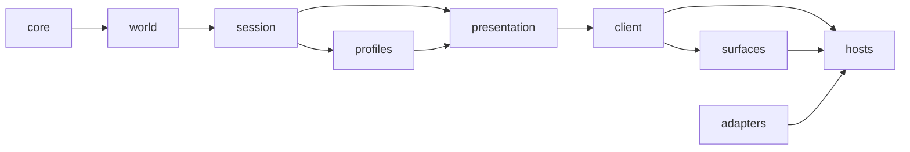

# Open Sim — cliente portátil, superfícies e jogo automatizado

**Status:** especificação proposta; nenhuma funcionalidade descrita aqui deve ser tomada como já implementada. Data: 2026-10-01. Base inspecionada: commit `d262e80` mais a revisão `review/speed-simplicity-beauty`.

**Objetivo:** o mesmo jogo — não só o mesmo núcleo — rodar em qualquer superfície (canvas no navegador, texto no terminal, desktop futuro, um robô de teste), mudando apenas a superfície e o host; e, com isso, provar o jogo no nível do jogador por roteiros executáveis, sem navegador.

Esta especificação estende a [carta de arquitetura](../../architecture.md) §2, §5, §6 e §12, a [implementação](../../implementation.md) §Apresentação e o [desenho original](2026-09-29-open-sim-design.md) §Arquitetura e critério 7. Nada aqui muda regra, formato ou protocolo: é a mesma cidade, separada de onde ela é mostrada.

## 1. O que já é verdade e o que falta

A portabilidade do **estado** já está provada: `replayScenario` produz o mesmo texto canônico em Node e no navegador (`implementation.md` §Prova de portabilidade), o pacote de conformidade reproduz o mesmo hash semântico nos dois runtimes (`protocol/world-v2.md` §3.2), e o teste de arquitetura compila `core` e `world` sem DOM e sem tipos de Node. A documentação já prevê a superfície de texto: "Um cliente com WebGL, terminal ou canvas de desktop não precisa tocar no núcleo" (`implementation.md` §Apresentação); "um jogo de cartas no terminal" compartilha as mesmas decisões (`kernel.md`).

A portabilidade do **jogo** não existe. O que o jogador faz — escolher uma ferramenta, traçar uma rua, ver o custo antes do clique, construir, acelerar o tempo, mexer no imposto, abrir uma célula, salvar, criar versão, comparar futuros, abrir sessão — está escrito em `src/browser/main.ts`: 1.045 linhas, das quais cerca de 60 tocam DOM. O resto é o controlador do perfil cidade preso ao cliente de referência. Consequências medidas na base:

- Um segundo cliente teria de reescrever `refreshPreview`, `commit`, `onPolicy`, `checkpoint`, `compareFutures`… e testaria a cópia, não o jogo.
- Nenhum teste exercita esse código: `basesFor`, `sameFrame` e o fluxo prévia→cobrança na interface só foram verificados por leitura.
- O tempo do cliente é o do navegador (`setTimeout`, `requestAnimationFrame`, `requestIdleCallback` espalhados): um teste não consegue avançar 30 segundos de jogo sem esperar 30 segundos.
- `src/presentation/` mistura receitas portáteis (`camera`, `clock`, `layout`, `world-diff`, a metade de `multiplayer.ts` que é `createGameSessionView`) com código de DOM e canvas (`hud`, `input`, painéis, `canvas-renderer`). A carta diz que as camadas puras "compilam sem DOM" (`protocol/adapters.md` §1), mas nada o verifica para `presentation`.

## 2. Requisitos

| ID | Requisito |
| --- | --- |
| P1 | Tudo o que o jogador pode pedir é uma **intenção** serializável, aceita por um único cliente portátil; nenhuma superfície decide regra, preço, permissão ou ordem. |
| P2 | Tudo o que uma superfície mostra vem de uma **vista** do cliente (dados puros); duas superfícies diante da mesma vista mostram a mesma cidade, os mesmos números e as mesmas mensagens. |
| P3 | O cliente portátil compila sem DOM e sem tipos de Node, como `core` e `world`, e o teste de arquitetura o prova. |
| P4 | O cliente não lê relógio nem agenda nada por conta própria: tempo de parede, atrasos e quadros chegam por uma porta. Com tempo manual, o mesmo roteiro produz a mesma sequência de vistas. |
| P5 | Durável e efêmero seguem a carta §5: só intenções que mudam o mundo viram `Action`; câmera, ferramenta, traço, hover e velocidade são estado do cliente e vão, no máximo, para o `view` do save. |
| P6 | Um **roteiro** (playthrough) é um arquivo de intenções e expectativas; o mesmo roteiro roda no host Node, numa página do navegador e no Vitest, e termina com o mesmo hash semântico e a mesma transcrição de vistas. |
| P7 | Jogar e testar não exigem rede: mapa sintético, armazenamento em memória e tempo manual bastam. Rede real é um modo de smoke, nunca pré-requisito. |
| P8 | Uma superfície nova é uma função de desenho e um tradutor de entrada; um host novo é composição de portas. Nenhum dos dois toca `core`, `world`, `session` ou o cliente. |
| P9 | O cliente de referência no navegador continua com o mesmo comportamento, desempenho e marcos de abertura (`first-frame`, `session-ready`, `map-visible-ready`). |
| P10 | Sem barramento de plugins, contêiner de injeção ou framework de UI (carta §11): composição explícita, como hoje em `main.ts`. |

## 3. Vocabulário

Os eixos já separados nos documentos continuam separados; este desenho só nomeia o que faltava.

| Termo | O que é | Exemplo |
| --- | --- | --- |
| **Perfil** | Regras e componentes que um jogo entende (carta, Layer G). | `city`, `explorer` |
| **Cliente portátil** | O jogo de um perfil para uma pessoa: estado efêmero, intenções, vista. Um por perfil jogável. | `createCityClient` |
| **Superfície** | Como a pessoa vê e age: desenha a vista, traduz gesto ou texto em intenção. | canvas+DOM, texto, robô |
| **Host** | O programa que compõe portas, cliente e superfície num runtime. | `src/browser/main.ts`, `tools/play.ts`, desktop futuro |
| **Porta** | Contrato para o mundo de fora, no estilo de `MapSource` e `SaveStore`. | `TimePort`, `FactsPort` |
| **Intenção** | O que a pessoa pediu, antes de ser regra. | `{do:'commit',cells}` |
| **Vista** | O que o cliente mostra, depois da regra. | `ClientView` |
| **Roteiro** | Intenções e expectativas gravadas; "cenário" fica reservado ao sentido de §4 da especificação federada. | `tests/playthroughs/*.json` |

## 4. Camadas



| Camada | Diretório | Pode importar | Compila sem DOM/Node |
| --- | --- | --- | --- |
| núcleo, mundo, sessão, perfis | como hoje | como hoje (`tests/architecture.test.ts`) | sim |
| apresentação portátil | `src/presentation/` | `core`, `world`, `session`, `profiles`, `presentation` | **sim (novo `tsconfig.presentation.json`)** |
| **cliente portátil** | `src/client/` | as acima e `client` | **sim (novo)** |
| **superfícies** | `src/surfaces/canvas/`, `src/surfaces/text/` | as acima e a própria superfície; canvas usa DOM, texto não usa nada | texto: sim; canvas: não |
| adaptadores | `src/adapters/` | como hoje | não |
| hosts | `src/browser/`, `tools/` | tudo | não |

A apresentação portátil fica com o que já é portátil (`camera`, `clock`, `layout`, `street-life` sem o desenho, `world-diff`, `frame-scheduler` e `createGameSessionView`). O que é DOM ou canvas muda para `src/surfaces/canvas/` (`canvas-renderer`, `hud`, `input`, `inspector`, painéis de histórico, cenários, fontes e multiplayer). A mudança é de lugar, não de comportamento; a superfície de texto nasce em `src/surfaces/text/` e é pura: recebe uma vista e devolve linhas, recebe uma linha e devolve intenções. Só o host lê `stdin` e escreve `stdout`.

## 5. O cliente portátil

### 5.1 Portas

| Porta | Contrato | Browser | Node / teste |
| --- | --- | --- | --- |
| `MapSource` | como hoje | OSM + worker + IndexedDB | fixture sintética; OSM opcional |
| `SaveStore` | como hoje | IndexedDB | memória ou arquivo |
| `WorldStorage` | como hoje | IndexedDB | memória |
| `TimePort` | `now(): number` (ms de parede), `after(ms, fn): Cancel`, `idle(fn, timeoutMs): Cancel` | `performance`/`setTimeout`/`requestIdleCallback` | relógio manual com `advance(ms)` |
| `FactsPort` | `named(name)`, `near(lat, lon)` → `CityFacts \| null` | Wikidata + IBGE | tabela fixa ou nada |
| `SessionPorts` | transporte, sinalização, identidade, verificador (os de `session` hoje) | WebRTC + manual | `memory` (dois clientes no mesmo processo) |

Quadros não são porta do cliente: animação (deslizar da câmera, trânsito) é da superfície. O cliente expõe `step(seconds)` para quem anima; uma superfície sem animação nunca o chama e a câmera chega no destino na hora.

### 5.2 Intenções

Uma união fechada, serializável em JSON, que cobre tudo o que `main.ts` trata hoje. Agrupadas pelas etapas de §8:

- **cidade**: `tool`, `hover`, `stroke`, `commit`, `cancel`, `speed`, `policy`, `inspect`, `retryMap`, `overwriteSave`;
- **lugar**: `pan`, `zoom`, `rotate`, `north`, `overview`, `place`, `goTo {lat, lon}`, `viewport {width, height}`;
- **versões**: `createVersion`, `selectBranch`, `compare`, `export`, `import {bytes}`, `region`;
- **futuros**: `compareFutures`;
- **sessão**: `openSession`, `invite`, `join`, `leave`, `transfer`, `pause`.

`client.do(intent)` devolve uma promessa que resolve quando a intenção foi decidida (aceita, recusada ou sem efeito), nunca antes. Gesto e tecla são problema da superfície: o canvas traduz arrasto em `stroke`, o texto traduz `rua 3,4 9,4` no mesmo `stroke` seguido de `commit`.

### 5.3 Vista

`client.view(): ClientView` é um objeto imutável, trocado por inteiro a cada mudança (identidade basta para saber se algo mudou, como `statsOf` faz hoje). Contém:

- `city`: `CityStats`, lugar, fatos reais e a escala ("um bairro dentro dela");
- `tool`, `speed`, `notice`, `map` (carregando, erro, atribuição), `save` (status do dispositivo ou da sessão);
- `preview`: células, custo, `affordable`, motivo — calculado por `quoteAction`, a mesma função que a sessão usa;
- `card`: a leitura de `describeCell` da célula aberta, ou nada;
- `world`: o `WorldView` que o canvas já consome (câmera, viewport, estado, trechos, prévia) — o canvas não muda de contrato;
- `history`, `scenarios`, `multiplayer`, `sources`: os modelos que os painéis já recebem em `update(...)`.

`client.subscribe(listener)` avisa que há vista nova; a superfície decide quando desenhar.

### 5.4 Tempo

Os três tempos da carta §6 ficam explícitos: o **tempo lógico** só avança por `tick` aceito; o **tempo de parede** só chega por `TimePort` e decide debounces (save 500 ms, mapa 200 ms), o relógio de ticks (`createTickClock`, que já aceita injeção) e a validade de convites; o **tempo de animação** é da superfície. Um roteiro escreve `{"wait": 5000}` e o host de teste avança o relógio manual: cinco ticks em 1×, dez em 2×, nenhum pausado, sem espera real.

## 6. Superfícies e hosts

**Canvas** (`src/surfaces/canvas/`): o que existe hoje, recebendo `ClientView` em vez de ler variáveis de `main.ts`. `attachInput` passa a emitir intenções. O pulo de quadro idêntico (`sameFrame`) e o agendador de quadros continuam aqui.

**Texto** (`src/surfaces/text/`): três funções puras.

- `renderText(view, options) → string[]`: cabeçalho com lugar, saldo, pessoas, felicidade, energia e mensagem; um recorte do mapa em volta do cursor, uma célula por caractere (`.` terra, `~` água, `"` verde, `-` rua, `=` avenida, `#` estrada, `R C I P E` construções, minúscula para lote vazio, `?` não carregado); a prévia e o custo; o card aberto.
- `parseCommand(line) → Intent[] | erro`: uma linguagem curta em português que é uma máscara das intenções (`ferramenta rua`, `rua 3,4 9,4`, `casa 5,5 7,6`, `demolir 4,4`, `ver 5,5`, `vel 2`, `espera 10s`, `imposto 12`, `ir São Paulo`, `versao "praça"`, `salvar`), com `json {...}` como escape para qualquer intenção.
- `transcript(view) → string`: a forma canônica e estável da vista para comparar execuções.

**Host Node** (`tools/play.ts`): interativo (`npx tsx tools/play.ts`) ou roteiro (`npx tsx tools/play.ts --script roteiro.json`). Usa mapa sintético por padrão e `--osm` para o mapa real; salva em arquivo com `--save`.

**Host navegador** (`src/browser/main.ts`): composição de portas, cliente e canvas, menor que hoje. Com `?record=1` grava as intenções do jogador num roteiro baixável: um defeito encontrado jogando vira um teste.

**Página de paridade** (`tests/browser/play.html`): roda um roteiro no navegador e imprime a transcrição e o hash semântico, como `replay.html` já faz para o núcleo.

## 7. Roteiros e testes no nível do jogador

```json
{
 "version": 1,
 "map": "fixture:town",
 "seed": 1,
 "steps": [
  {"say": "rua 2,3 8,3"},
  {"expect": {"preview.cost": 0, "city.money": 19930}},
  {"say": "casa 3,4 4,5"},
  {"say": "usina 9,4"},
  {"say": "vel 2"},
  {"wait": 60000},
  {"expect": {"city.population": {"min": 1}}},
  {"say": "salvar"},
  {"reopen": true},
  {"expect": {"city.money": "unchanged", "tool": "explore"}}
 ],
 "final": {"semanticHash": "…"}
}
```

`say` passa pela superfície de texto (testa a superfície e o cliente); `do` entrega a intenção direto (testa só o cliente). `expect` lê caminhos da vista; `reopen` destrói o cliente e o recria sobre os mesmos armazenamentos, que é o que o jogador vive ao recarregar a página.

Camadas de prova, da mais barata à mais cara:

| Prova | Onde | Rede |
| --- | --- | --- |
| Unidades e núcleo (os 503 testes de hoje) | Vitest | não |
| Roteiros do jogador | `tests/playthroughs/*.json` via `tests/playthrough.test.ts` | não |
| Paridade Node ↔ navegador do roteiro | `tools/play.ts --script` e `tests/browser/play.html`: mesmo hash e mesma transcrição | não |
| Dois jogadores | um roteiro com `as: "ana"` / `as: "bia"`, host e réplica no mesmo processo sobre transporte em memória | não |
| Smoke do mapa real | `tools/play.ts --osm --script` | sim, opcional |
| Desempenho do canvas | `npm run perf:browser`, como hoje | não |

## 8. Entregas

Cada etapa mantém a suíte verde, o typecheck e o build, e não muda comportamento visível no navegador; a medida de saída é `main.ts` menor e roteiros novos passando.

| Etapa | Entrega | Prova de saída |
| --- | --- | --- |
| A | `TimePort`; `src/client/` com cidade (ferramenta, traço, prévia, commit, recusa, velocidade, ticks, política, card, save/restauração); superfície de texto; `tools/play.ts`; primeiros roteiros; `main.ts` usando o cliente para esse escopo | roteiros de construir, crescer, recusar por saldo, demolir, reabrir |
| B | lugar e câmera (pan, zoom, rotação, lugares, carga do visível, fatos reais) no cliente | roteiro que muda de cidade e constrói nas duas |
| C | versões, histórico, comparação, exportação/importação | roteiro que cria versão, compara e reimporta |
| D | comparar futuros | roteiro que compara parque × indústria |
| E | sessão cooperativa no cliente; transporte em memória no host de teste | roteiro de dois jogadores com recusa por permissão e por custo |
| F | divisão de `presentation` (portátil × canvas), `tsconfig.presentation.json` e `tsconfig.client.json` sem DOM, teste de arquitetura com as camadas novas, página de paridade, gravação `?record=1` | arquitetura e paridade |

## 9. Cenários obrigatórios de aceitação

| Cenário | Evidência |
| --- | --- |
| Construir rua, casa e usina, esperar e ver gente chegar | roteiro `construir-e-crescer` |
| A prévia mostra exatamente o que é cobrado | roteiro compara `preview.cost` antes e a diferença de `city.money` depois |
| Projeto acima do saldo é recusado inteiro, com motivo | roteiro `saldo-insuficiente` |
| Pausa não avança tempo; 2× avança o dobro | roteiro `tempo` com relógio manual |
| Reabrir devolve a mesma cidade e a mesma câmera | roteiro com `reopen` |
| Save ilegível não é sobrescrito sem pedido | roteiro com `SaveStore` corrompido |
| A mesma partida em Node e no navegador | mesmo hash semântico e mesma transcrição |
| Uma superfície nova não importa o núcleo para decidir nada | teste de arquitetura: `surfaces` só importa `client`, `presentation` e tipos |
| O navegador não ficou mais lento | `perf:browser` dentro do orçamento atual |

## 10. Riscos e decisões

- **Tamanho da extração.** `main.ts` concentra sessão cooperativa, histórico e cenários com efeitos assíncronos encadeados. Por isso a ordem de §8 começa pelo laço da cidade e deixa a sessão por último, com os testes de multiplayer existentes como rede de proteção.
- **Vista grande demais.** Copiar o estado inteiro a cada mudança custaria caro; a vista referencia o `GameState` (já imutável) em vez de copiá-lo, e só os modelos derivados são recalculados, sob cache por identidade.
- **Duas linguagens de entrada.** O comando de texto é só açúcar para intenções; o roteiro grava intenções, não texto, quando vem do navegador. A gramática fica pequena e documentada no próprio `parseCommand`.
- **Determinismo de testes com rede.** Roteiros de aceitação usam fixture; o smoke OSM nunca entra no gate de `npm run check`.
- **Não generalizar.** Um cliente por perfil; o explorador continua sendo executor de linha de comando até precisar de vista própria.

## Execução

| Etapa | O que mudou | Verificação |
| --- | --- | --- |
| C+D | Versões e futuros no cliente: `src/client/versions.ts` (`createVersions`) recebe `WorldRepository`, codec e hasher como portas e as datas ISO de parede pelo `TimePort` (`isoOf`/`wall()`), nunca `Date` direto. Fluxos movidos de `main.ts`: `open` (save legado vira geração 1), `checkpoint` após ação aceita (o `commit` do roteador da sessão delega aqui), `createVersion`/`selectBranch`/`compare` (com `diffWorlds`, prefixo de hash ou `anterior`), `export` devolvendo bytes (host decide download×arquivo), `import` de bytes (CONFLICT quando o ramo já existe), `region`, e `compareFutures` (`freeBlock`, `appliedProject`, `runScenario`/`compareScenarios`/`describeScenarios`). A vista carrega `history`, `branches`, `scenarios`, `export`. Modelos puros extraídos para `src/presentation/world-{composition,history}-model.ts` (sem DOM), consumidos por cliente e painéis. Intenções novas: `openWorld`, `createVersion`, `selectBranch`, `compare`, `export`, `import`, `region`, `compareFutures`. Superfície de texto: `versoes`, `versao "nome"`, `ramo <nome>`, `comparar <hash\|anterior>`, `exportar <arq>` e `importar <arq>` (host faz o I/O), `futuros`; `versionsLines`/`scenariosLines`. `tools/play-host.ts` compõe `createWorldMemoryStorage`, JCS e `bytesHasher`. `main.ts` deixou de ter o grafo de versões, a comparação e os futuros — só compõe as portas e desenha os painéis a partir da vista. Novos: `src/client/versions.ts`; roteiros `versoes-e-comparacao.json`, `exportar-e-importar.json`, `futuros-parque-industria.json`; `tests/versions.test.ts`. | `tsc --noEmit` 0; `tsc -p tsconfig.client.json` 0; `biome lint` 0 erros (9 avisos pré-existentes em testes); `vitest run` 533 passam, 5 pulados (+10); `vite build` ok |
| B | Lugar e câmera no cliente: estado e matemática da câmera (pan, zoom, rotação, norte, visão geral, alvo de deslize com `step(seconds)`; superfície sem animação chega na hora), `viewport`, lugares (`PLACES` com fatos empacotados), `goTo lat,lon` com validação, carga do visível (`loadVisible` com orçamentos overview/detail, `retainVisible`, `requested`, mensagem `Carregando mapa…`, falha e `retryMap`, enriquecimento via `TimePort`, debounce 200 ms) e fatos reais atrás de um `FactsPort` (fixture nos testes, Wikidata+IBGE compostos no host). Superfície de texto: a janela segue a câmera; comandos `ir`, `mover`, `zoom +/-`, `norte`, `visao geral`, `tentar de novo`, `cidade`. `main.ts` ficou host fino: compõe adaptadores, traduz eventos em intenções, roda o laço de deslize chamando `client.step` e desenha a vista. Novos: `src/client/facts.ts`; roteiros `cidade-e-mapa.json` e `reabrir-camera.json`; `tests/place-camera.test.ts`. | `tsc --noEmit` 0; `tsc -p tsconfig.client.json` 0; `biome lint` 0 erros (9 avisos pré-existentes em testes); `vitest run` 523 passam, 5 pulados; `vite build` ok |
| E | Sessão cooperativa no cliente: `src/client/session.ts` (`createSessionController`) orquestra abrir/convidar/entrar/transferir/pausar/sair sobre o roteador (`GameSessionView`), a máquina de versões (ramifica da versão na tela) e o papel do relógio (só o anfitrião marca o tempo). Chaves, transporte e sinalização são **adaptadores** injetados pelo host via `SessionPorts`: `src/adapters/session/memory.ts` (host Node/teste, transporte e registro em memória, dois clientes num processo) e `src/adapters/session/webrtc.ts` (navegador, WebRTC + sinalização manual). A metade portátil da experiência saiu de `multiplayer.ts` para `src/presentation/session-view.ts` (compila sem DOM/Node, no `tsconfig.client.json`); o painel-canvas e `sessionText` ficaram em `multiplayer.ts` reexportando. `main.ts` deixou de ter `createCooperativeSession`/`shareInvite`/`join`/`transfer`/`close`/`localFirst`/`sendPresence` (~235 linhas): compõe `createWebRtcSessionPorts` e traduz os botões do painel em intenções. Formato de roteiro ganhou `as:"nome"` por passo (dois clientes num transporte/registro compartilhados). Intenções novas: `openSession`, `invite`, `join`, `transfer`, `pauseSession`, `leaveSession`; comandos de texto `sessao abrir\|convite\|entrar <texto>\|sair\|pausar\|transferir <ator>`. Novos: `src/client/session.ts`, `src/adapters/session/{memory,webrtc}.ts`, `src/presentation/session-view.ts`; roteiro `sessao-cooperativa.json` (anfitriã e réplica constroem, a réplica vê o estado confirmado; negativos: a réplica não marca o tempo e uma proposta sem ferramenta é recusada); `tests/session-client.test.ts`. Lacuna: entrar como réplica por WebRTC espera o sinal assinado da Tarefa 8; no navegador o `join` resolve o descritor e informa que o canal da réplica não abre; o fan-out de presença saiu com os peers e volta pelas portas quando esse canal for conduzido. | `tsc --noEmit` 0; `tsc -p tsconfig.client.json` 0; `biome lint` 0 erros (9 avisos pré-existentes em testes); `vitest run` 537 passam, 5 pulados (+4); `vite build` ok |
| F | Fronteiras, paridade e gravação. (1) `src/presentation/` ficou só com o portátil (câmera, relógio, layout, traços, ferramentas, texto de carta, palavras, world-diff, a **lógica** de vida nas ruas, agendador de quadros, os modelos de histórico/composição e `session-view`) e **compila sem DOM/Node** (`tsconfig.presentation.json`, afirmado em `tests/architecture.test.ts`). O que é DOM/canvas foi para `src/surfaces/canvas/`: `canvas-renderer`, `street-life-draw` (o desenho que saiu de `street-life.ts`), `hud`, `input`, `inspector`, `source-inspector`, `world-history`, `world-composition` e `multiplayer-panel` (o painel que saiu de `multiplayer.ts`; a metade portátil continua em `session-view.ts`, reexportada por `multiplayer.ts`). `frame-scheduler` ficou portátil lendo os relógios da plataforma de `globalThis` em vez de nomeá-los. `sessionText` (usa `TextDecoder`) foi para `src/adapters/session/descriptor.ts`. Imports de `main.ts` e dos testes atualizados; a regra "apresentação não importa superfície" já estava no teste de arquitetura. (2) Paridade: `tests/browser/play.html` + `play.ts` rodam um roteiro no navegador pelo mesmo cliente (mapa sintético, relógio manual, armazenamento em memória) e imprimem transcrição e hash semântico, espelhando `replay.html`; `tools/play.ts --script` já imprime o mesmo hash, fixado em `tests/parity.test.ts` (lado Node). (3) Gravação: em `main.ts` com `?record=1` cada intenção vira um passo `{do:…}` (com `{wait:ms}` entre elas pelo `TimePort`), fora da interface normal, lida por `window.openSimRecording()` e baixável por um botão discreto; `hover` é descartado (estado efêmero, P5). (4) Docs e tabelas atualizadas. `main.ts` 692 → 739 linhas: a etapa não move lógica de jogo para fora (só realoca apresentação→superfície, que não mexe no tamanho de `main.ts`), e o gravador opcional somou ~47 linhas de host. Novos: `src/surfaces/canvas/{canvas-renderer,street-life-draw,hud,input,inspector,source-inspector,world-history,world-composition,multiplayer-panel}.ts`, `src/adapters/session/descriptor.ts`, `tsconfig.presentation.json`, `tests/browser/play.{html,ts}`, `tests/parity.test.ts`. Sem comandos ou intenções novas (etapa estrutural); sem mudar regra, formato ou protocolo. | `tsc --noEmit` 0; `tsc -p tsconfig.client.json` 0; `tsc -p tsconfig.presentation.json` 0; `biome lint` 0 erros (9 avisos pré-existentes em testes); `vitest run` 538 passam, 5 pulados (+1, o teste de paridade); `vite build` ok |
| Jogar e melhorar | Três sessões longas (>40 comandos) pelo host de terminal (`npm run play`, piped): crescer a cidade a 170+ pessoas, a economia (imposto/serviços/empréstimo/dívida/crise), demolir, todas as classes de via e zonas, versões/comparação/futuros, trocar de cidade (Lisboa↔São Paulo), reabrir e a sessão cooperativa pelo roteiro existente. **Achado principal — falta de feedback:** o terminal mostrava só saldo/pessoas/felicidade/energia; quando a economia entra em crise (`money=0` e `monthly.net<0`, com o caixa travado em zero em `simulation.ts`) o jogador no terminal não tinha como ver *por quê* a cidade parou — imposto, serviços, receita, despesa, saldo mensal, dívida, juros, classificação, demanda e a própria linha de crise só existiam no HUD do canvas. **Correções:** (1) novo comando `prefeitura`/`economia` (view-only, sem intenção) que imprime essas contas **com as mesmas palavras do HUD** — `economyPanel`/`netText` em `src/presentation/words.ts`, agora consumidas pelo HUD (`src/surfaces/canvas/hud.ts`) e pela superfície de texto (`prefeituraLines` em `render.ts`), uma formatação por número; (2) dicas de faixa na própria superfície para `imposto`/`servicos`/`emprestar` (ex.: "Imposto de 0 a 20: 25 está fora."), ensinando o limite antes do mundo recusar com o seco "fora do intervalo" — a checagem autoritativa continua no núcleo. Nada de regra, formato ou protocolo mudou; não houve reequilíbrio da economia (o laço crise→empréstimo→cortar serviços→superávit foi verificado jogando e está correto). Falsos positivos descartados: nomes de lugar são acento-insensíveis ("ir Sao Paulo" funciona — o "S??o Paulo" visto foi corrupção de encoding do pipe do PowerShell, não do jogo). Novos: comando `prefeitura` (HELP atualizado); roteiro `prefeitura-e-crise.json` (lê a economia, cai em crise com a linha de crise, sai com empréstimo+cortes; negativos: três recusas de faixa na superfície); `tests/prefeitura.test.ts` (palavras compartilhadas, parsing view-only, dicas de faixa, economia legível numa cidade nova). | `tsc --noEmit` 0; `tsc -p tsconfig.client.json` 0; `tsc -p tsconfig.presentation.json` 0; `biome lint` 0 erros (9 avisos pré-existentes em testes); `vitest run` 543 passam, 5 pulados (+5: 4 de `prefeitura.test.ts` + 1 roteiro novo); `vite build` ok |
| Auditoria | Auditoria independente das etapas A–F e dos cenários da §9. Verifiquei todos os gates (números abaixo), `grep` em `src/browser/main.ts` (sem `applyCommand`/`describeCell`/`createTickClock`/`setTimeout`/`requestIdleCallback`; o `quoteAction` e os `new Date`/`Date.now` que restam são porta de composição do host — `quote`/`now`/`monotonic` passados ao `GameSessionView` — e `requestAnimationFrame`/`sameFrame` são a animação e o salto de quadro do canvas, que a §5.1/§6 mandam ficar na superfície), e confirmei que `src/client` e `src/surfaces/text` não leem relógio nem aleatório (o único `Date` do cliente é `isoOf`, que formata o `time.wall()` da porta, nunca o relógio de parede). Rodei os 11 roteiros por `npx tsx tools/play.ts --script` duas vezes cada: todos saída 0 e hash semântico estável entre as duas corridas. Três expectativas deliberadamente erradas (valor exato, booleano, `min`) deram saída 1 com o motivo (`esperava X, veio Y`). **Defeito encontrado e corrigido:** o teste de arquitetura (`tests/architecture.test.ts`, "every relative import … never look the wrong way") era um no-op — o tokenizador emite espaços como tokens `code` próprios, então o token antes do especificador era sempre um espaço, nunca `from`/`import`, e **nenhum** import relativo era detectado (0 em toda a `src`): a regra de camadas (P3/P8) não era imposta. Corrigi `dependencies()` para descartar também tokens em branco; o probe `src/presentation` → `src/surfaces` passou a ser pego (`imports the surfaces layer`). Com o parser funcionando, 9 imports reais afloraram, todos de `adapters/session/{descriptor,memory,webrtc}.ts` e `adapters/time/system.ts` para `presentation/session-view` e `client/{session,time}`: são adaptadores implementando as portas `SessionPorts`/`TimePort` que o cliente declara (etapas E/F) — direção descendente correta, mas o allowlist `ALLOWED['adapters']` era anterior a elas. Ampliei para incluir `client` e `presentation` (um adaptador pode alcançar a camada que declara a porta que ele implementa, como já alcança `session` para `MapSource`/`SaveStore`). Nenhuma regra, formato, protocolo, intenção ou string de jogo mudou; só o teste de arquitetura. Arquivos: `tests/architecture.test.ts` (parser de imports + allowlist + comentário). | `tsc --noEmit` 0; `tsc -p tsconfig.client.json` 0; `tsc -p tsconfig.presentation.json` 0; `biome lint` 0 erros (9 avisos pré-existentes em testes); `vitest run` 543 passam, 5 pulados; `vite build` ok; 11 roteiros saída 0 e hash estável ×2; 3 expectativas erradas → saída 1; probe `presentation→surfaces` → teste de arquitetura falha |
| Pós-merge | Alinhamento da arquitetura após o merge de `origin/codex/open-sim-design`. O upstream trouxe `src/session/city-agent.ts` (`executeCityRequest`: ops JSON sobre a `LocalSession`) e `tools/city.ts` (`npm run city`) como um caminho paralelo que duplicava quote e bases disponíveis fora do cliente portátil. Agora `tools/city.ts` é um **segundo host de terminal** do **mesmo** cliente: a superfície pura `src/surfaces/json/city-json.ts` (parse do pedido → intenções ou consulta; resposta a partir do `ClientView`) mantém o contrato que `tests/city-agent.test.ts` fixa (inspect/quote/act/advance/save/load; `ok`, `revision`, `tick`, `result`/`error`). O avanço de ticks usa uma intenção `tick` nova (um tick a 1× = 1000 ms) que roda pelo mesmo roteador do relógio — nenhum laço de `session.dispatch` no host. `src/session/city-agent.ts` foi **removido** (nada mais o usava) e sua lógica duplicada com ele; o cliente ganhou `quote(action)`/`snapshot()`/`restore(save)` puros, e `restore` passou a adotar o viewpoint salvo como `start()` já fazia (um `load` reabre a mesma câmera). `tools/city.ts` aceita `--fixture` para rodar offline com o mapa sintético. A superfície JSON entrou em `tsconfig.client.json`, provada sem DOM/Node pelo teste de arquitetura, como a de texto. Os arquivos novos do upstream ficaram nas camadas certas (`session/map-streaming.ts`, `presentation/viewpoint.ts` — este importado por `src/client`; `adapters/osm/region-cache.ts`; `browser/offline-controller.ts`; `public/sw.js` fora de qualquer tsconfig). Novos: `src/surfaces/json/city-json.ts`, `tests/city-json-surface.test.ts`; `tests/city-agent.test.ts` reapontado para a superfície (cada asserção preservada; o round-trip afirma centro + metadados em vez de `toEqual` porque o viewpoint recomputa x/y). Sem mudar regra, formato ou protocolo. | `tsc --noEmit` 0; `tsc -p tsconfig.client.json` 0; `tsc -p tsconfig.presentation.json` 0; `biome lint` 0 erros (9 avisos pré-existentes); `vitest run` 618 passam, 5 pulados, 70 arquivos (+3); `vite build` ok; 11 roteiros saída 0; `npm run city -- --fixture` responde offline, saída 0 |
